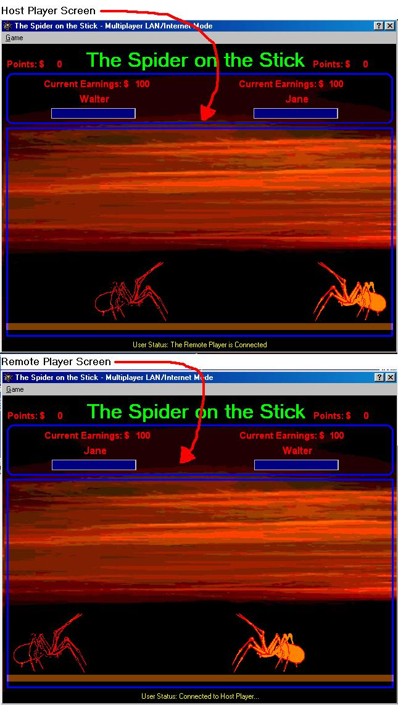



## DUAL SPIDER GAME via LAN TCIP/IPX \(A must see\.\.This is actually the last version of it\.\)

### Description

This game is the second and the last version of my Spider on the Stick Game. New added features in this game are you can play this game via LAN/Internet TCPIP/IPX Connections and after you defeat your remote opponent you can select new type of species of spider according to the money or points you earned each time you defeat your opponent. And if you choose a stage or level the current backround of the game will also changed according to the title of the stages. The Sound Files are not included coz my ISP is very slow & i encounter problems uploading it. IF YOU LIKE THIS CODE JUST VOTE FOR IT. Have Fun!!
 
### More Info
 

             |
---                |---
**Submitted On**   |2001-04-02 00:43:16
**By**             |[Walter Narvasa](https://github.com/Planet-Source-Code/PSCIndex/blob/master/ByAuthor/walter-narvasa.md)
**Level**          |Advanced
**User Rating**    |4.4 (40 globes from 9 users)
**Compatibility**  |VB 6\.0
**Category**       |[Games](https://github.com/Planet-Source-Code/PSCIndex/blob/master/ByCategory/games__1-38.md)
**World**          |[Visual Basic](https://github.com/Planet-Source-Code/PSCIndex/blob/master/ByWorld/visual-basic.md)
**Archive File**   |[DUAL SPIDE17783412001\.zip](https://github.com/Planet-Source-Code/walter-narvasa-dual-spider-game-via-lan-tcip-ipx-a-must-see-this-is-actually-the-last-vers__1-22068/archive/master.zip)

